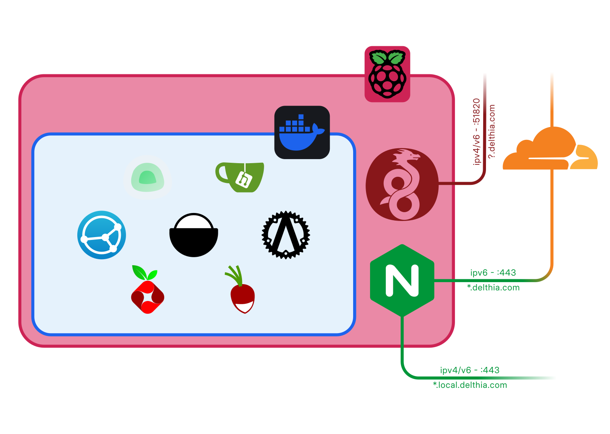

+++
title = 'Selfhosting'
date = 2024-12-26T18:57:48+01:00
draft = false
tags = ['selfhosting']
+++

Desde hace cuatro años, debajo de mi escritorio hay una Raspberry que cuelga de manera precaria de un cable de ethernet. No es el *home server* más potente que se haya visto nunca, pero cubre mis necesidades; la utilizo de VPN, servidor de archivos, de calendarios y de git y es mi pequeño servidor web.

Todo empezó con un servidor de [mumble](https://mumble.info), por aquella época en la que estábamos encerrados en casa; luego descubrí [gitea](), y junto con [nginx]() fue todo lo que tenía esa raspberry, hasta que encontré [docker]() y [nextcloud]().

El objetivo de este artículo es documentar qué hay en la Raspberry, ya que recientemente la reinstalé completamente al mover el sistema operativo de una micro SD de 32Gb a un SDD SATA de 1TB.

## Hardware

El hardware no podría ser más sencillo: una Raspberry Pi 4 de 4GB conectada a un SSD de 1TB con un adaptador de USB a SATA. Hasta ahora siempre tuvo una micro SD, primero de 16Gb y luego de 32Gb, pero al añadir el SSD tengo más espacio para utilizar con syncthing, e incluso un servidor NFS, además de que moví ahí el sistema.

## Software

En cuanto al software, durante mucho tiempo utilicé ubuntu, cuando empecé a usar la raspberry con docker era interesante tener un sistema de 64 bits, pero con al pasarlo al SSD instalé Raspberry Pi OS (raspbian), basado en Debian 11, también de 64 bits, que ahora ya es estable. Sobre esto se ejecutan NGINX, WireGuard y Docker.

### WireGuard

Tener un servidor de VPN en casa resulta muy práctico, tanto para acceder a los servicios de docker que solo son accesibles desde la red local como para redirigir todo el tráfico por la red de casa cuando resulta más fiable que la red a la que estoy conectado.

Utilizo WireGuard porque es verdaderamente sencillo y ligero y tiene un buen cliente en Android. Está instalado directamente en el *host* con [este script](https://git.io/wireguard), que permite crear configuraciones fácilmente. Descubrí el script en [esta guía de Wolfgang](https://notthebe.ee/blog/set-up-your-own-vpn-on-raspberry-pi/) y su correspondiente [vídeo de YouTube](https://www.youtube.com/watch?v=rtUl7BfCNMY). Además, todos los clientes están configurados para utilizar PiHole de DNS.

### NGINX

NGINX es el reverse proxy que utilizo. Funciona bien y es fácil de configurar y también está instalado en el host porque me resulta natural que sea así, además de que de este modo es sencillo de utilizar certbot para obtener los certificados SSL.

Certbot está configurado para conseguir los certificados verificando el dominio por DNS, en lugar de por HTTP y utilizo un wildcard para `*.delthia.com, delthia.com`.

### DNS

Para el DNS utilizo Cloudflare, donde está registrado `delthia.com`, que se actualiza con un contenedor de docker, [cloudflare-ddns](https://github.com/oznu/docker-cloudflare-ddns#creating-a-cloudflare-api-token), pero lo mismo se podría hacer con [ddclient](https://ddclient.net/), y [DuckDNS](https://duckdns.org), que utilizo de respaldo y con la VPN, para tener un segundo dominio desde el que acceder, en caso de que falle el contenedor de docker, ya que DuckDNS se actualiza con un script de BASH que ejecuta cron.

Además, en `*.local.delthia.com` están todos los servicios locales, de modo que NGINX está configurado para solo aceptar conexiones a esos subdominios desde la subred de la VPN y la red local de casa.

### Docker

En Docker están todos los demás servicios, lo que permite recrear los contenedores al reinstalar el sistema de manera muy rápida utilizando `docker-compose` y copiando los volúmenes que contienen todos los datos. Actualmente ejecuto los siguientes contenedores:

- **Umami**: Servidor de analíticas. Antes utilizaba plausible, pero era mucho más pesado.
- **Syncthing**: Un fantástico programa que permite sincronizar archivos entre dispositivos de punto a punto. El objetivo de tener una instancia en la Raspberry es tener un nodo siempre activo con el que poder sincronizar el portátil y el sobremesa aunque no estén los dos encendidos al mismo tiempo.
- **Radicale**: Servidor de DAV, lo utilizo para sincronizar calendarios y contatos entre dispositivos. En android utilizo [DAVx5](https://www.davx5.com/) y en linux funciona de forma nativa, tanto en GNOME como en KDE, además de en Thunderbird.
- **Vaultwarden**: Versión alternativa del servidor del gestor de contraseñas [bitwarden](https://bitwarden.com) que funciona con los clientes oficiales.
- **PiHole**: Servidor DNS con listas de bloqueo que únicamente utilizo para WireGuard, pues al cambiar a una LAN con ipv6 pihole en docker daba problemas.
- **Gitea**: Servidor de git en el que tengo todos los repositorios de git que no son públicos.

Además, aunque actualmente activos, estos son los contenedores que utilicé en algún momento:

- **Nextcloud**: Servidor de archivo, calendarios y más, muy útil para trabajar entre varias personas, pero más pesado que un servidor de DAV y de ficheros sencillos. Dejé de utilizarlo porque no necesitaba las características de *groupware*.
- **Code server**: VS Code en el navegador, similar a [github.dev](https://github.dev)

Otro contenedor que se ejecuta es el de mi página [bus.delthia.com](https://bus.delthia.com), que es un contenedor de Python basado en Alpine que ejecuta una aplicación de Flask usando Gunicorn.

## Configuración de red

El resultado final es el que se puede ver en este diagrama:

NGINX está escuchando por el puerto de HTTPS solo por ipv6, así que utilizo el proxy de cloudflare para que mi sitio web sea accesible también desde ipv4.
