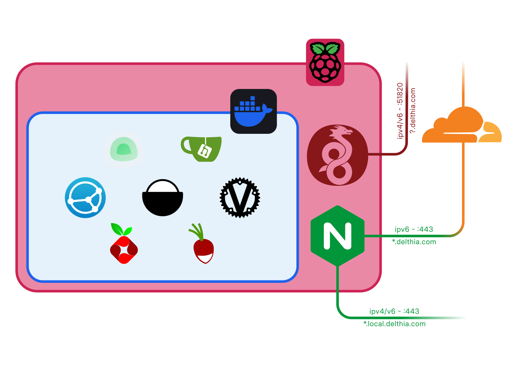

+++
title = 'Selfhosting'
date = 2025-02-26T23:00:00+01:00
draft = false
tags = ['selfhosting']
+++

Desde hace cinco años, debajo de mi escritorio hay una Raspberry que cuelga de manera precaria de un cable de ethernet. No es el *home server* más potente que se haya visto nunca, pero cubre mis necesidades; la utilizo de VPN, servidor de archivos, de calendarios, de servidor de git y es mi pequeño servidor web.

Todo empezó con un servidor de [Mumble](https://www.mumble.info/), por aquella época en la que estábamos encerrados en casa; luego descubrí [Gitea](https://about.gitea.com/), y junto con [NGINX](https://nginx.org/) fue todo lo que tenía esta Raspberry, hasta que encontré [Docker](https://www.docker.com/) y [Nextcloud](https://nextcloud.com/).

Recientemente le instalé un SSD SATA de 1TB para tener más espacio y un almacenamiento más rápido que la micro SD que tenía. Puedo decir que la diferencia de rendimiento es bastante mayor de lo que esperaba, haciendo mucho maś rápidas cosas como extraer imágenes de docker.

Después de reinstalarlo todo, aprovecho para documentar de qué manera está configurado.

## ¿Por qué?

Tener un "servidor" en casa es de las cosas más prácticas y útiles que hago. Limita mi dependencia a empresas a la vez que me da, en muchas ocasiones, un mejor servicio más versátil y privado. Soy capaz de sincronizar archivos, calendarios y contactos de manera sencilla, tener una web en la que publicar mis ideas y proyectos y sirve de plataforma para aprender y aportar al internet de sitios pequeños gestionado por personas (*webmasters*, como se les solía llamar) que me gusta.

Podía tener una red de varios nodos de proxmox, con un RAID con 20 discos y todo conectado con una red de 10Gbit, pero actualmente, mi confiable Raspberry es capaz de hacer el 80% de lo que necesito consumiendo y ocupando mucho menos. Y esa es parte de la magia... una pequeña caja que me da todo el servicio que necesito, solo para mí y que apenas requiere mantenimiento.

## Hardware

El hardware no podría ser más sencillo: una Raspberry Pi 4 de 4GB conectada a un SSD de 1TB con un adaptador de USB a SATA. Hasta ahora siempre tuvo una micro SD, primero de 16GB y luego de 32GB, pero al añadir el SSD tengo más espacio para utilizar con syncthing, e incluso un servidor NFS, además de que moví ahí el sistema.

La Raspberry está conectada por ethernet al router a través de un switch y ahí empieza y termina toda la complejidad del sistema.

El motivo para utilizar una Raspberry es muy sencillo: Después de comprar una Raspberry Pi 3 en 2016 y usarla mucho, cuando se anunció la siguiente versión decidí comprarla, ya que parecía que sería mucho mejor para el uso que le daba a la Pi 3, principalmente de ordenador de escritorio. Al final, como ya la tenía, decidí que quería aprender a configurarla como servidor, así que me puse a ello, primero con unas pocas aplicaciones y luego con Docker, hasta llegar a hoy.

## Software

En cuanto al software, durante mucho tiempo utilicé ubuntu, cuando empecé a usar la raspberry con docker era interesante tener un sistema de 64 bits, pero con al pasarlo al SSD instalé Raspberry Pi OS (raspbian), basado en Debian 11, también de 64 bits, que ahora ya es estable. Sobre esto se ejecutan NGINX, WireGuard y Docker.

### WireGuard

Tener un servidor de VPN en casa resulta muy práctico, tanto para acceder a servicios de docker que no están directamente expuestos a internet como para redirigir todo el tráfico por la red de casa cuando resulta más fiable que la red a la que estoy conectado.

Utilizo WireGuard porque es verdaderamente sencillo y ligero y tiene un buen cliente en Android. Está instalado directamente en el *host* con [este script](https://git.io/wireguard), que permite crear configuraciones fácilmente. Descubrí el script en [esta guía de Wolfgang](https://notthebe.ee/blog/set-up-your-own-vpn-on-raspberry-pi/) y su correspondiente [vídeo de YouTube](https://www.youtube.com/watch?v=rtUl7BfCNMY). Además, todos los clientes están configurados para utilizar PiHole de DNS.

### NGINX

NGINX es el reverse proxy que utilizo. Funciona bien y es fácil de configurar y también está instalado en el host porque me resulta natural que sea así, además de que de este modo es sencillo de utilizar certbot para obtener los certificados SSL.

Certbot está configurado para conseguir los certificados verificando el dominio por DNS, en lugar de por HTTP y utilizo un wildcard para `*.delthia.com, delthia.com` y otro para `*.local.delthia.com, local.delthia.com`.

### DNS

Para el DNS utilizo Cloudflare, donde está registrado `delthia.com`, que se actualiza con un contenedor de docker, [cloudflare-ddns](https://github.com/oznu/docker-cloudflare-ddns#creating-a-cloudflare-api-token), pero lo mismo se podría hacer con [ddclient](https://ddclient.net/), y [DuckDNS](https://duckdns.org), que utilizo de respaldo y para la VPN, para tener un segundo dominio desde el que acceder, en caso de que falle el contenedor de docker, ya que DuckDNS se actualiza con un script de BASH que ejecuta cron.

Además, en `*.local.delthia.com` están todos los servicios locales, de modo que NGINX está configurado para solo aceptar conexiones a esos subdominios desde la subred de la VPN y la red local de casa.

### Docker

En Docker están todos los demás servicios, lo que permite recrear los contenedores al reinstalar el sistema de manera muy rápida utilizando `docker-compose` y copiando los volúmenes que contienen todos los datos. Actualmente ejecuto los siguientes contenedores:

- **Umami**: Servidor de analíticas. Antes utilizaba plausible, pero era mucho más pesado.
- **Syncthing**: Un fantástico programa que permite sincronizar archivos entre dispositivos de punto a punto. Tenerlo en la raspberry me permite tener un nodo siempre activo con el que poder sincronizar el portátil y el sobremesa aunque no estén los dos encendidos al mismo tiempo.
- **Radicale**: Servidor de DAV. Lo utilizo para sincronizar calendarios y contatos entre dispositivos. En android utilizo [DAVx5](https://www.davx5.com/) y en linux funciona de forma nativa, tanto en GNOME como en KDE, además de en Thunderbird.
- **Vaultwarden**: Versión alternativa del servidor del gestor de contraseñas [Bitwarden](https://bitwarden.com) que funciona con los clientes oficiales.
- **PiHole**: Servidor DNS con listas de bloqueo que únicamente utilizo para WireGuard, ya que al cambiar a una LAN con ipv6 PiHole en docker me daba problemas.
- **Gitea**: Servidor de git en el que tengo todos los repositorios de git que no son públicos.

Además, aunque actualmente inactivos, estos son los contenedores que utilicé en algún momento:

- **Nextcloud**: Servidor de archivos, calendarios y más, muy útil para trabajar entre varias personas, pero más pesado que utilizar un servidor de DAV y otro de ficheros independientes. Dejé de utilizarlo porque no necesitaba las características de *groupware*.
- **Code server**: VS Code en el navegador, similar a [github.dev](https://github.dev)

Otro contenedor que se ejecuta es el de mi página [bus.delthia.com](https://bus.delthia.com), que es un contenedor de Python basado en Alpine que ejecuta una aplicación de Flask usando Gunicorn.

Además de los servicios descritos aquí, tengo otras utilidades, como un servidor de [Postgres](https://www.postgresql.org/) y [Adminer](https://www.adminer.org/) para gestionarlo, [Grafana](https://grafana.com/), o un [contenedor que actualiza el DNS de cloudflare](https://github.com/oznu/docker-cloudflare-ddns#creating-a-cloudflare-api-token). Por último, instalado directamente en debian, utlizo [rclone](https://rclone.org/) para servir una de las carpetas que se sincroniza con [syncthing](https://syncthing.net/) por webdav, para poder acceder a los documentos de clase fácilmente desde una tablet o móvil.

## Configuración de red

El resultado final es el que se puede ver en este diagrama:

NGINX está escuchando por el puerto 443 (HTTPS) solo por ipv6, así que utilizo el proxy de cloudflare para que mi sitio web sea accesible también desde ipv4. Algunos servicios, los que están asignados en un subdominio de `local.delthia.com`, están limitados a la red local y a la de la VPN.

Todo está disponible a través de ipv6 además de ipv4, ya que es inevitable adoptar ipv6 antes o después, y no resulta demasiado complicado configurarlo. En lugar de una redirección de puertos se trata de simplemente abrir el puerto correspondiente en el cortafuegos del router (con el inconveniente de que si cambia la ip pública también lo hará la privada, cosa que dependerá del router concreto cómo se gestiona).

## Conclusión

Cinco años después tengo todo lo que necesito configurado de manera sencilla. Una vez que está todo configurado por primera vez, migrar a un sistema operativo nuevo es cuestión de copiar los directorios de datos que quiero preservar y reinstalar el sistema. A continuación instalo docker y todo lo que necesito y con docker compose se recrean los contenedores. Tras copiar algunos archivos de configuración (por ejemplo de nginx) y otros, como los crontabs, todo está listo y funcionando tal y como lo hacía unas horas antes.

No puedo estar más contento con mi pequeño servidor y animo a cualquiera que le interese a hacer lo mismo.
